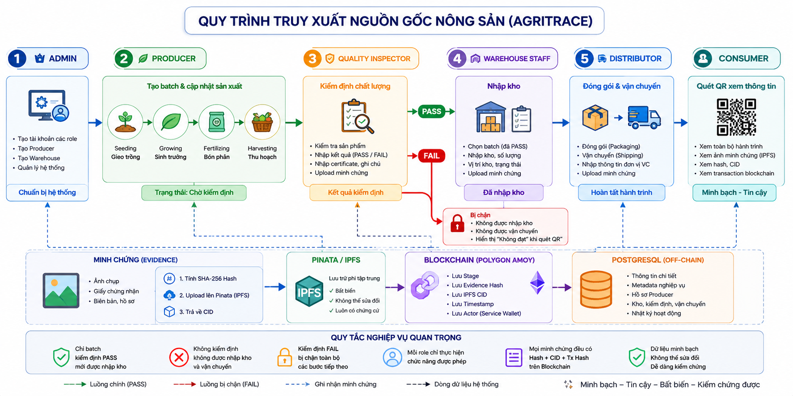
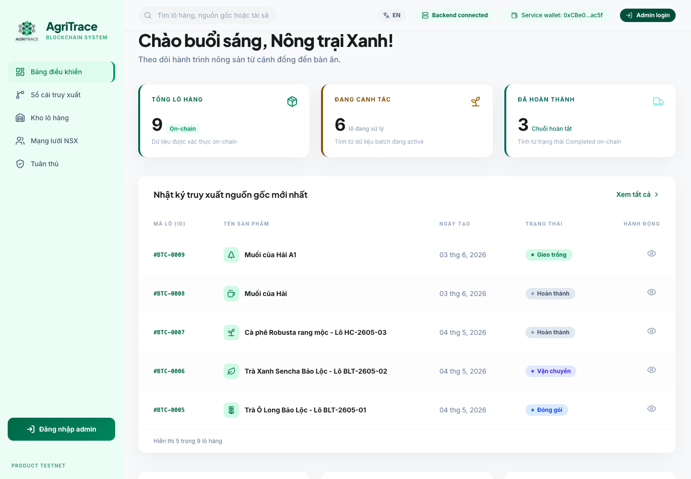
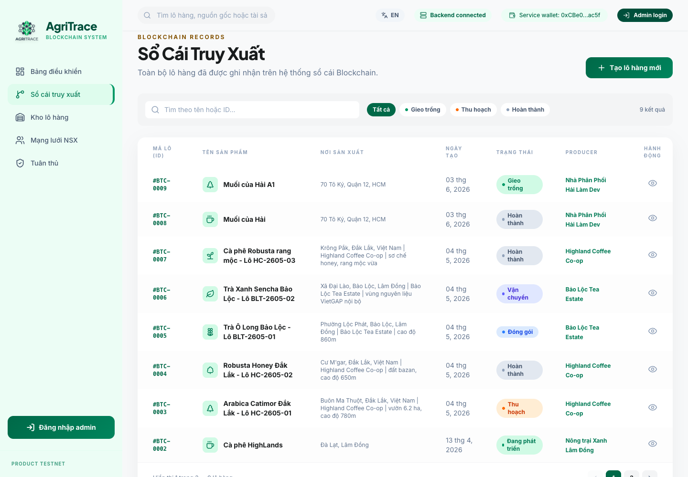
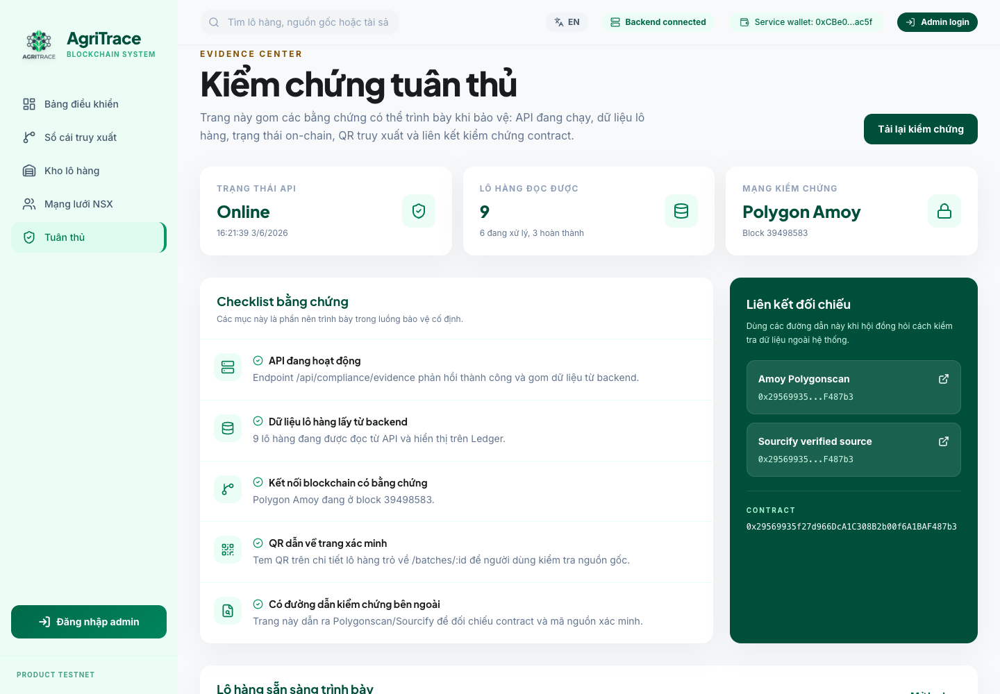
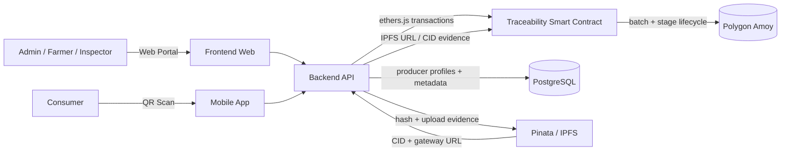
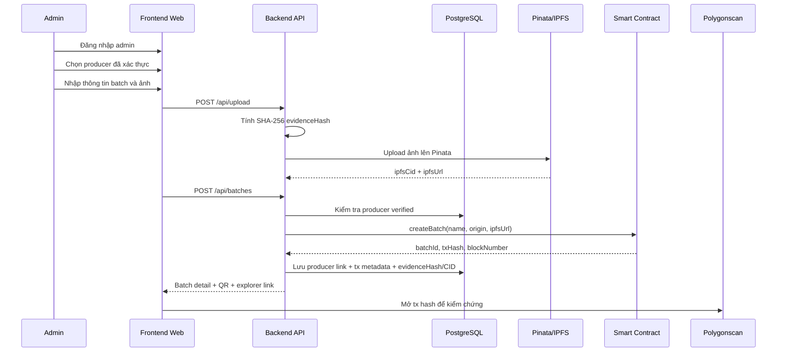

<p align="center">
  
</p>

<h1 align="center">
  AgriTrace - Blockchain Truy Xuất Nguồn Gốc Nông Sản
</h1>

<h3 align="center">
  Solidity + Polygon Amoy + Pinata/IPFS + Express.js + PostgreSQL + React Vite
</h3>

<p align="center">
  Hệ thống quản lý vòng đời lô nông sản bằng mô hình hybrid on-chain/off-chain, hỗ trợ QR verification, quản lý đối tác chuỗi cung ứng và compliance evidence.
</p>

<p align="center">
  <a href="https://agri.hailamdev.space/"><b>Production demo</b></a>
  ·
  <a href="https://agri.hailamdev.space/batches">Sổ cái truy xuất</a>
  ·
  <a href="https://agri.hailamdev.space/compliance">Kiểm chứng tuân thủ</a>
</p>

<p align="center">
  
  
  
  
  
  
  
  
</p>

---

## Tổng quan

AgriTrace là dự án truy xuất nguồn gốc nông sản bằng blockchain. Hệ thống quản lý lô hàng từ lúc tạo lô, cập nhật các giai đoạn sản xuất/vận chuyển, gắn ảnh minh chứng, sinh QR verification và hiển thị bằng chứng giao dịch trên Polygon Amoy.

Dự án không đưa toàn bộ dữ liệu lên blockchain. AgriTrace dùng mô hình hybrid:

- Smart contract lưu dữ liệu lõi, bất biến của lô hàng và lịch sử stage.
- PostgreSQL lưu hồ sơ nhà sản xuất, liên kết producer-batch, trạng thái kiểm định, transaction metadata và dữ liệu phục vụ UI.
- Pinata/IPFS lưu file ảnh minh chứng; backend tính `evidenceHash` SHA-256 và trả về `ipfsCid/ipfsUrl`. Contract schema v2 lưu URL IPFS, hash và CID trong stage record, còn PostgreSQL lưu metadata để UI truy vấn nhanh.
- Backend đóng vai trò relayer, dùng service wallet ký giao dịch để người vận hành không cần thao tác ví crypto trực tiếp.

Mô hình này giúp dự án vẫn đúng trọng tâm blockchain nhưng có đủ tính thực tế của một sản phẩm quản lý nông sản.

## Demo production

| Mục | Link |
| --- | --- |
| Web app production | [https://agri.hailamdev.space/](https://agri.hailamdev.space/) |
| Sổ cái truy xuất | [https://agri.hailamdev.space/batches](https://agri.hailamdev.space/batches) |
| Kiểm chứng tuân thủ | [https://agri.hailamdev.space/compliance](https://agri.hailamdev.space/compliance) |

Nếu backend Render đang cold start, trang có thể mất vài giây để tải số liệu blockchain/database lần đầu.

## Ảnh giao diện production

### Dashboard



### Sổ cái truy xuất



### Kiểm chứng tuân thủ



## Tính năng chính

- **Smart contract traceability**: Tạo batch, thêm stage, lưu timestamp, owner/service wallet, trạng thái hiện tại và lịch sử stage trên-chain.
- **QR verification**: Mỗi lô hàng có link xác minh công khai để người dùng kiểm tra vòng đời lô hàng.
- **Producer/partner management**: Admin tạo, chỉnh sửa, xác thực hồ sơ nhà sản xuất/đối tác và liên kết với batch.
- **Multi-role relayer workflow**: Backend ký transaction lên Polygon Amoy, giảm rào cản ví/gas cho producer, inspector, warehouse và distributor.
- **Compliance evidence dashboard**: Hiển thị API health, DB status, contract address, batch summary, transaction hash, block number, link Polygonscan và trạng thái source verification.
- **Hybrid data model**: Phân tách rõ dữ liệu on-chain và off-chain để tránh lưu dữ liệu hồ sơ/ảnh lớn trực tiếp lên blockchain.
- **Search, inventory và export CSV**: Hỗ trợ tìm batch/producer, theo dõi tồn kho nhập/xuất/giữ hàng và xuất dữ liệu phục vụ báo cáo/demo.

## Kiến trúc thư mục

```text
agri-traceability-system/
├── smart-contracts/    Hardhat project, Solidity contract, deploy scripts
├── backend/            Express.js API, ethers.js, PostgreSQL, Pinata/IPFS
├── frontend-web/       React Vite operations portal, ledger, QR, compliance UI
├── mobile-app/         Expo React Native consumer QR scanner
└── docs/               Tài liệu kiến trúc, demo, phản biện và data model
```

## Tech stack

| Lớp | Công nghệ | Vai trò |
| --- | --- | --- |
| Blockchain network | Polygon Amoy testnet | Mạng testnet dùng để ghi transaction truy xuất nguồn gốc. |
| Smart contract | Solidity `0.8.24`, Hardhat | Quản lý batch, stage history, whitelist và event bằng chứng. |
| Blockchain SDK | ethers.js v6 | Backend gọi contract, đọc dữ liệu on-chain và gửi transaction. |
| Backend | Node.js, Express.js | API relayer, multi-role auth/RBAC, upload IPFS evidence, tổng hợp dashboard/compliance. |
| Database | PostgreSQL trên Railway | Lưu user role, producer profile, batch-producer links, inspection/warehouse metadata, inventory movement và transaction metadata. |
| Frontend web | React, Vite, Tailwind CSS | Giao diện operations/public: dashboard, ledger, producer, compliance, QR, kiểm định, nhập kho. |
| Evidence storage | Pinata/IPFS, Unsplash/image library | Lưu file minh chứng theo CID; backend tính SHA-256 hash để đối chiếu. |
| Deploy | Render, Vercel, Railway | Backend, frontend và database production/demo. |

## Kiến trúc tổng quan



## Mô hình dữ liệu On-chain / Off-chain

AgriTrace dùng blockchain để giữ bằng chứng bất biến, còn database xử lý metadata vận hành. Đây là điểm quan trọng khi trình bày đề tài: database không thay thế blockchain, mà bổ sung cho blockchain để sản phẩm dùng được trong thực tế.

| Lớp | Dữ liệu lưu | Mục đích |
| --- | --- | --- |
| Smart contract | Batch ID, tên lô, nguồn gốc, owner/service wallet, stage hiện tại, thời gian tạo, trạng thái active, stage history, `imageUrl` IPFS, `evidenceHash`, `ipfsCid`, whitelist và events | Bằng chứng bất biến cho vòng đời lô hàng. |
| PostgreSQL | Hồ sơ producer, contact, verification status, producer-batch links, actor role, tx hash, block number, `evidenceHash`, `ipfsCid`, `ipfsUrl`, dashboard/search metadata | Quản trị, tìm kiếm, hiển thị UI và liên kết dữ liệu nghiệp vụ. |
| Pinata/IPFS | File ảnh minh chứng theo CID | Lưu media phi tập trung hơn URL thường; CID/hash giúp kiểm tra file có bị thay đổi không. |

Xem tài liệu chi tiết tại [docs/ONCHAIN_OFFCHAIN.md](docs/ONCHAIN_OFFCHAIN.md).

## Luồng nghiệp vụ chính



## Nâng cấp v2: Quality Inspection, Warehouse và IPFS evidence

Production demo hiện đã chạy flow schema v2 để trình bày nghiệp vụ chuỗi cung ứng chặt hơn:

```text
Create Batch
→ Seeding
→ Growing
→ Fertilizing
→ Harvesting
→ QualityInspection
→ WarehouseReceived
→ Packaging
→ Shipping
→ Completed
```

- `QualityInspection`: inspector nhập kết quả `PASS/FAIL`, điểm/ghi chú/chứng nhận và ảnh minh chứng. Chỉ batch đạt kiểm định mới nên được nhập kho.
- `WarehouseReceived`: nhân viên kho ghi nhận kho nhận hàng, số lượng, vị trí kho, tình trạng và ảnh biên nhận.
- Evidence upload: backend tính SHA-256, pin file lên Pinata/IPFS, trả `ipfsCid/ipfsUrl`.
- Contract schema v2: [smart-contracts/contracts/Traceability.sol](smart-contracts/contracts/Traceability.sol) có stage `QualityInspection`, `WarehouseReceived`, `evidenceHash`, `ipfsCid`. File [TraceabilityV2.sol](smart-contracts/contracts/TraceabilityV2.sol) được giữ như bản tham chiếu.
- Polygon Amoy v2 deployment: `0xA94D8877f8d85Aa1c6f3280989172600EACb7ed8` ([Polygonscan](https://amoy.polygonscan.com/address/0xA94D8877f8d85Aa1c6f3280989172600EACb7ed8)). Deployment metadata: [smart-contracts/deployments/amoy-traceability-v2.json](smart-contracts/deployments/amoy-traceability-v2.json).
- Production backend đang dùng `CONTRACT_STAGE_SCHEMA=v2`, nên batch mới có thể ghi trực tiếp `QualityInspection`, `WarehouseReceived`, `evidenceHash` và `ipfsCid` lên contract v2.

## Giới hạn hiện tại và hướng phát triển

Phần này được nêu rõ để phản biện thấy phạm vi dự án minh bạch. AgriTrace hiện là product demo/testnet phục vụ báo cáo tốt nghiệp, chưa tự nhận là hệ thống production thương mại hoàn chỉnh.

### Giới hạn hiện tại

| Vấn đề | Hiện trạng | Lý do chấp nhận trong phạm vi đề tài |
| --- | --- | --- |
| Blockchain network | Đang chạy trên Polygon Amoy testnet. | Phù hợp demo học thuật, không phát sinh chi phí mainnet và vẫn có transaction thật để kiểm chứng. |
| Service wallet relayer | Backend dùng một service wallet để ký transaction thay người dùng. | Giúp người dùng nông nghiệp không cần cài ví hoặc trả gas; đây là mô hình phù hợp UX cho B2B/demo. |
| Producer-batch link | Quan hệ producer với batch lưu ở PostgreSQL metadata và được hiển thị ở Batch Detail/Ledger. | Contract hiện tập trung vào lifecycle của lô hàng; metadata producer cần linh hoạt để cập nhật hồ sơ. Hướng phát triển là neo thêm `producerProfileHash`. |
| Ảnh minh chứng | File upload được pin lên Pinata/IPFS. Contract schema v2 lưu IPFS gateway URL, `evidenceHash` và `ipfsCid`; PostgreSQL lưu thêm metadata hiển thị. | Tránh lưu byte ảnh trên-chain, vẫn có CID/hash để kiểm chứng nội dung. |
| Xác thực và phân quyền | Auth dùng email/password/JWT, có role `ADMIN`, `PRODUCER`, `QUALITY_INSPECTOR`, `WAREHOUSE_STAFF`, `DISTRIBUTOR`. | Đủ cho demo vận hành nhiều vai trò; chưa phải hệ thống enterprise IAM hoàn chỉnh. |
| Dữ liệu kiểm định | Một số chứng nhận/audit là testnet record, không phải chứng nhận pháp lý thật. | Phục vụ mô phỏng nghiệp vụ và được gắn nhãn testnet/demo trong UI. |
| Tính sẵn sàng hệ thống | Backend/DB phụ thuộc Render/Railway; cold start có thể làm lần tải đầu chậm vài giây. | Chấp nhận được cho demo; có cache đọc blockchain và health status để minh bạch trạng thái hệ thống. |

### Hướng phát triển

- **Neo producer metadata vào blockchain**: Thêm `producerIdHash`, `producerProfileHash` hoặc `metadataHash` vào transaction để chứng minh quan hệ producer-batch không chỉ nằm ở DB.
- **Verify source contract**: xác thực source contract trên Polygonscan/Sourcify để giảng viên có thể đối chiếu contract deployed với source trong repo.
- **Phân quyền nhiều vai trò nâng cao**: Tách ví hoặc tài khoản blockchain cho producer, distributor, inspector thay vì toàn bộ transaction đều do service wallet relayer ký.
- **Audit trail cho database**: Ghi lịch sử thay đổi producer profile, trạng thái kiểm định và metadata liên kết để truy vết thao tác admin.
- **Nâng cấp hạ tầng production**: Dùng Redis/shared cache, queue cho transaction, monitoring/logging và chiến lược retry khi RPC hoặc DB lỗi.
- **Mở rộng mobile/consumer flow**: Hoàn thiện app QR scanner cho người tiêu dùng, hiển thị thông tin batch công khai và cảnh báo khi dữ liệu chưa đủ bằng chứng.

Tóm lại, AgriTrace chọn phạm vi thực tế: blockchain đảm bảo bằng chứng bất biến cho vòng đời lô hàng, còn off-chain database phục vụ quản trị và trải nghiệm người dùng. Các giới hạn trên là hướng phát triển tự nhiên nếu dự án được nâng từ demo tốt nghiệp lên sản phẩm production.

## Cài đặt nhanh

```bash
# Cài dependencies cho toàn bộ npm workspaces
npm install

# Compile smart contract
npm run contracts:compile

# Chạy test smart contract
npm run contracts:test

# Chạy backend local, mặc định port 3000
npm run backend:dev

# Chạy frontend local, mặc định port 5173
npm run frontend:dev

# Chạy mobile app Expo
npm run mobile:start
```

## API chính

| Method | Endpoint | Mô tả |
| --- | --- | --- |
| `POST` | `/api/auth/login` | Đăng nhập tài khoản vận hành theo role. |
| `GET` | `/api/auth/me` | Kiểm tra phiên người dùng/role hiện tại. |
| `GET` | `/api/auth/me/audit-log` | Mini audit log cho user/producer link hiện tại. |
| `POST` | `/api/batches` | Tạo lô hàng mới và ghi transaction lên smart contract. |
| `GET` | `/api/batches` | Danh sách batch từ smart contract, kèm metadata producer/transaction nếu có. |
| `GET` | `/api/batches/:id` | Chi tiết batch. |
| `GET` | `/api/batches/:id/history` | Lịch sử stage on-chain của batch. |
| `POST` | `/api/batches/:id/stages` | Thêm stage mới cho batch. |
| `GET` | `/api/users` | Admin xem danh sách tài khoản vận hành. |
| `POST` | `/api/users` | Admin tạo tài khoản role mới. |
| `PATCH` | `/api/users/:id` | Admin cập nhật tài khoản/role/liên kết producer/kho. |
| `PATCH` | `/api/users/:id/disable` | Admin vô hiệu hóa tài khoản. |
| `GET` | `/api/inspections/queue` | Hàng chờ kiểm định cho `QUALITY_INSPECTOR`. |
| `POST` | `/api/batches/:id/quality-inspections` | Ghi stage `QualityInspection` và metadata kiểm định. |
| `GET` | `/api/warehouses` | Danh sách kho nhận hàng. |
| `POST` | `/api/warehouses` | Admin tạo kho nhận hàng. |
| `PATCH` | `/api/warehouses/:id` | Admin cập nhật kho nhận hàng. |
| `GET` | `/api/warehouse/receiving-queue` | Hàng đã PASS chờ nhập kho cho `WAREHOUSE_STAFF`. |
| `GET` | `/api/warehouse/receipts` | Lịch sử biên nhận nhập kho. |
| `GET` | `/api/warehouse/inventory` | Inventory từ các batch đã nhập kho. |
| `POST` | `/api/warehouse/inventory/movements` | Ghi movement xuất kho/giữ hàng/đã vận chuyển off-chain. |
| `POST` | `/api/batches/:id/warehouse-receipts` | Ghi stage `WarehouseReceived` và metadata nhập kho. |
| `GET` | `/api/distributor/queue` | Hàng chờ đóng gói/vận chuyển cho `DISTRIBUTOR`. |
| `POST` | `/api/upload` | Upload file evidence lên Pinata/IPFS, trả SHA-256 hash và CID. |
| `GET` | `/api/producers` | Danh sách producer. |
| `POST` | `/api/producers` | Tạo producer profile. |
| `PATCH` | `/api/producers/:id` | Cập nhật hồ sơ producer. |
| `PATCH` | `/api/producers/:id/status` | Cập nhật trạng thái verified/audit pending. |
| `GET` | `/api/dashboard/summary` | Dashboard summary từ blockchain + database. |
| `GET` | `/api/compliance/evidence` | Compliance evidence, contract/network links và batch summary. |
| `GET` | `/api/health` | Health check API, database và cấu hình backend. |

## Biến môi trường

| Khu vực | Biến chính |
| --- | --- |
| `smart-contracts/` | RPC URL, private key deploy/testnet. |
| `backend/` | `DATABASE_URL`, RPC URL, `CONTRACT_ADDRESS`, `CONTRACT_STAGE_SCHEMA`, service wallet private key, `PINATA_JWT`, `IPFS_GATEWAY`, `ADMIN_EMAIL`, `ADMIN_PASSWORD`, `JWT_SECRET`, `SEED_DEMO_USERS`, `SEED_DEMO_PRODUCERS`, `SOURCIFY_VERIFIED`, CORS origin. |
| `frontend-web/` | `VITE_API_URL`, các biến public phục vụ frontend nếu có. |

Không commit private key, database URL, JWT secret hoặc tài khoản admin thật vào repo.

## Tài khoản demo local/dev

Backend seed admin từ `ADMIN_EMAIL`, `ADMIN_PASSWORD`, `ADMIN_NAME`. Các tài khoản role dưới đây chỉ được seed tự động khi không chạy production, hoặc khi bật `SEED_DEMO_USERS=true` cho môi trường demo. Producer seed/fallback bị tắt ở production trừ khi bật rõ `SEED_DEMO_PRODUCERS=true`.

| Role | Email | Mật khẩu | Ghi chú |
| --- | --- | --- | --- |
| `PRODUCER` | `producer@agritrace.local` | `Producer@123` | Tạo batch và cập nhật Seeding, Growing, Fertilizing, Harvesting. |
| `QUALITY_INSPECTOR` | `inspector@agritrace.local` | `Inspector@123` | Kiểm định PASS/FAIL và upload evidence IPFS. |
| `WAREHOUSE_STAFF` | `warehouse@agritrace.local` | `Warehouse@123` | Nhập kho các batch đã kiểm định PASS. |
| `DISTRIBUTOR` | `distributor@agritrace.local` | `Distributor@123` | Cập nhật Packaging, Shipping, Completed. |

Không dùng các mật khẩu demo này cho production chính thức.

## Tài liệu liên quan

- [On-chain vs Off-chain Data Model](docs/ONCHAIN_OFFCHAIN.md)
- [Kiến trúc và bảo mật](docs/KIEN_TRUC_VA_BAO_MAT.md)
- [Hướng dẫn demo](docs/HUONG_DAN_DEMO.md)
- [Câu hỏi phản biện ngắn gọn](docs/CAU_HOI_PHAN_BIEN_NGAN_GON.md)
- [Câu hỏi phản biện](docs/CAU_HOI_PHAN_BIEN.md)

## License

MIT
