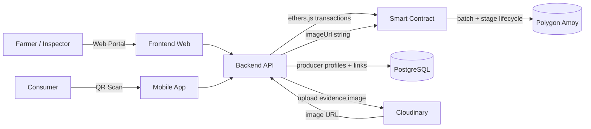
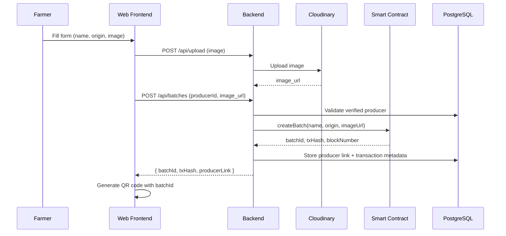

<p align="center">
  
</p>

<h1 align="center">Agri Traceability System</h1>

<p align="center">
  Blockchain-based agricultural product traceability — from seed to shelf.
</p>

<p align="center">
  
  
  
  
  
  
  
  
</p>

---

## About

Manages the lifecycle of agricultural product batches from seeding to delivery. Core batch and stage records are written to the smart contract for immutable verification; producer profiles, batch-producer links, dashboard metrics and search metadata are stored off-chain in PostgreSQL. Evidence images are hosted externally, and their URLs can be recorded on-chain as part of each batch/stage transaction. A QR code is generated per batch for public verification.

### Production Features (Latest Updates)
- **Hybrid on-chain/off-chain data model**: Smart contract stores immutable batch lifecycle data; PostgreSQL stores operational metadata.
- **Admin relayer workflow**: Backend service wallet signs Polygon Amoy transactions so users do not need to manage wallets or gas.
- **Producer management**: Admin can create, edit and verify producer profiles before linking them to batches.
- **Compliance evidence dashboard**: Surfaces API health, DB status, contract address, transaction records and explorer links.
- **CSV data export**: Exports ledger data with producer and transaction metadata where available.
- **Vercel SPA routing**: Supports direct access to React Router pages in production.

## Project Structure

```
agri-traceability-system/
├── smart-contracts/    Hardhat project, Solidity contracts, deploy scripts
├── backend/            Node.js Express API, Cloudinary integration
├── frontend-web/       React (Vite) admin portal for farmers & inspectors
├── mobile-app/         Expo React Native consumer app (QR scanning)
└── docs/               Architecture, demo, defense and data model documents
```

## Tech Stack

<table>
  <tr>
    <td><b>Layer</b></td>
    <td><b>Technology</b></td>
  </tr>
  <tr>
    <td>Smart Contract</td>
    <td> </td>
  </tr>
  <tr>
    <td>Backend</td>
    <td>  </td>
  </tr>
  <tr>
    <td>Database</td>
    <td></td>
  </tr>
  <tr>
    <td>Image Storage</td>
    <td></td>
  </tr>
  <tr>
    <td>Frontend Web</td>
    <td>  </td>
  </tr>
  <tr>
    <td>Mobile App</td>
    <td> </td>
  </tr>
  <tr>
    <td>Networks</td>
    <td> </td>
  </tr>
</table>

## Architecture



## Data Model: On-chain vs Off-chain

AgriTrace uses a hybrid model to keep the traceability proof immutable without turning the blockchain into a file store or admin database.

| Layer | Stored data | Purpose |
|-------|-------------|---------|
| Smart contract | Batch ID, name, origin, owner/service wallet, current stage, creation time, active status, stage history, image URL strings, whitelist state and events | Immutable lifecycle evidence for each agricultural batch. |
| PostgreSQL | Producer profiles, contact fields, verification status, producer-batch links, actor roles, transaction hashes, block numbers and dashboard/search metadata | Operational management, UI enrichment and fast lookup. |
| Cloudinary / image library | Image files selected or uploaded by admins | Stores media assets; the smart contract only stores the URL string when submitted. |

See [docs/ONCHAIN_OFFCHAIN.md](docs/ONCHAIN_OFFCHAIN.md) for the detailed data boundary, defense talking points and future improvements.

## Quick Start

```bash
# Install all dependencies (npm workspaces)
npm install

# Compile smart contract
npm run contracts:compile

# Run contract tests
npm run contracts:test

# Start backend (port 3000)
npm run backend:dev

# Start frontend (port 5173)
npm run frontend:dev

# Start mobile app (Expo)
npm run mobile:start
```

## API Reference

| Method | Endpoint | Description |
|--------|----------|-------------|
| `POST` | `/api/batches` | Create a new batch |
| `GET` | `/api/batches/:id` | Get batch info |
| `POST` | `/api/batches/:id/stages` | Add a growth stage |
| `GET` | `/api/batches/:id/history` | Get stage timeline |
| `GET` | `/api/batches/total` | Total batch count |
| `GET` | `/api/producers` | List producer profiles |
| `POST` | `/api/producers` | Create a producer profile |
| `PATCH` | `/api/producers/:id` | Update a producer profile |
| `GET` | `/api/dashboard/summary` | Live dashboard summary |
| `GET` | `/api/compliance/evidence` | Compliance evidence summary |
| `POST` | `/api/upload` | Upload image to Cloudinary |
| `POST` | `/api/auth/login` | Admin login |
| `GET` | `/api/health` | Health check |

## Environment Setup

Copy `.env.example` in each sub-directory and fill in your values:

| Directory | Variables |
|-----------|----------|
| `smart-contracts/` | Private key, RPC URLs (Sepolia, Amoy) |
| `backend/` | `DATABASE_URL`, blockchain RPC, contract address, service wallet private key, Cloudinary credentials, admin auth variables |
| `frontend-web/` | `VITE_API_URL` for the deployed backend API |

## Core Workflow



## License

MIT
