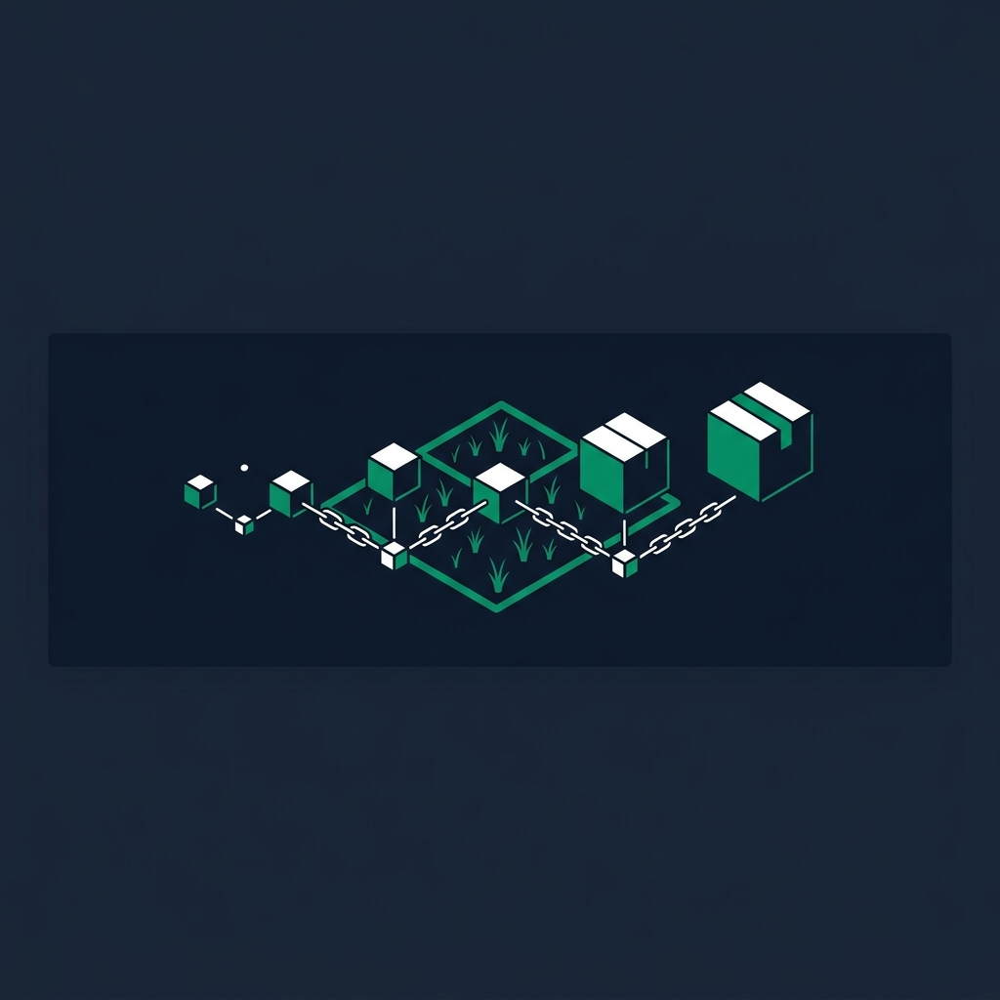
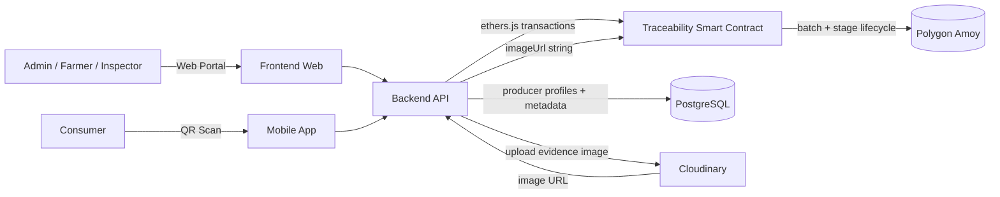
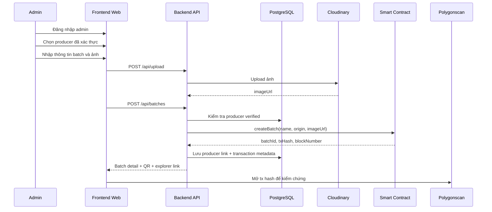

<p align="center">
  
</p>

<h1 align="center">
  AgriTrace - Blockchain Truy Xuất Nguồn Gốc Nông Sản
</h1>

<h3 align="center">
  Solidity + Polygon Amoy + Express.js + PostgreSQL + React Vite
</h3>

<p align="center">
  Hệ thống quản lý vòng đời lô nông sản bằng mô hình hybrid on-chain/off-chain, hỗ trợ QR verification, producer management và compliance evidence.
</p>

<p align="center">
  
  
  
  
  
  
  
  
</p>

---

## Tổng quan

AgriTrace là dự án truy xuất nguồn gốc nông sản bằng blockchain. Hệ thống quản lý lô hàng từ lúc tạo lô, cập nhật các giai đoạn sản xuất/vận chuyển, gắn ảnh minh chứng, sinh QR verification và hiển thị bằng chứng giao dịch trên Polygon Amoy.

Dự án không đưa toàn bộ dữ liệu lên blockchain. AgriTrace dùng mô hình hybrid:

- Smart contract lưu dữ liệu lõi, bất biến của lô hàng và lịch sử stage.
- PostgreSQL lưu hồ sơ nhà sản xuất, liên kết producer-batch, trạng thái kiểm định, transaction metadata và dữ liệu phục vụ UI.
- Cloudinary/thư viện ảnh lưu file ảnh; smart contract chỉ lưu chuỗi `imageUrl` khi ảnh được gắn vào transaction.
- Backend đóng vai trò relayer, dùng service wallet ký giao dịch để admin không cần thao tác ví crypto trực tiếp.

Mô hình này giúp dự án vẫn đúng trọng tâm blockchain nhưng có đủ tính thực tế của một sản phẩm quản lý nông sản.

## Tính năng chính

- **Smart contract traceability**: Tạo batch, thêm stage, lưu timestamp, owner/service wallet, trạng thái hiện tại và lịch sử stage trên-chain.
- **QR verification**: Mỗi lô hàng có link xác minh công khai để người dùng kiểm tra vòng đời lô hàng.
- **Producer management**: Admin tạo, chỉnh sửa, xác thực hồ sơ nhà sản xuất và liên kết producer với batch.
- **Admin relayer workflow**: Backend ký transaction lên Polygon Amoy, giảm rào cản ví/gas cho người vận hành.
- **Compliance evidence dashboard**: Hiển thị API health, DB status, contract address, batch summary, transaction hash, block number và link Polygonscan/Sourcify.
- **Hybrid data model**: Phân tách rõ dữ liệu on-chain và off-chain để tránh lưu dữ liệu hồ sơ/ảnh lớn trực tiếp lên blockchain.
- **Search, inventory và export CSV**: Hỗ trợ tìm batch/producer, theo dõi danh sách lô hàng và xuất dữ liệu phục vụ báo cáo/demo.

## Kiến trúc thư mục

```text
agri-traceability-system/
├── smart-contracts/    Hardhat project, Solidity contract, deploy scripts
├── backend/            Express.js API, ethers.js, PostgreSQL, Cloudinary
├── frontend-web/       React Vite admin portal, ledger, QR, compliance UI
├── mobile-app/         Expo React Native consumer QR scanner
└── docs/               Tài liệu kiến trúc, demo, phản biện và data model
```

## Tech stack

| Lớp | Công nghệ | Vai trò |
| --- | --- | --- |
| Blockchain network | Polygon Amoy testnet | Mạng testnet dùng để ghi transaction truy xuất nguồn gốc. |
| Smart contract | Solidity `0.8.24`, Hardhat | Quản lý batch, stage history, whitelist và event bằng chứng. |
| Blockchain SDK | ethers.js v6 | Backend gọi contract, đọc dữ liệu on-chain và gửi transaction. |
| Backend | Node.js, Express.js | API relayer, auth admin, upload ảnh, tổng hợp dashboard/compliance. |
| Database | PostgreSQL trên Railway | Lưu producer profile, batch-producer links, transaction metadata. |
| Frontend web | React, Vite, Tailwind CSS | Giao diện admin/public: dashboard, ledger, producer, compliance, QR. |
| Image storage | Cloudinary, Unsplash/image library | Lưu ảnh minh chứng hoặc ảnh chọn từ thư viện. |
| Deploy | Render, Vercel, Railway | Backend, frontend và database production/demo. |

## Kiến trúc tổng quan



## Mô hình dữ liệu On-chain / Off-chain

AgriTrace dùng blockchain để giữ bằng chứng bất biến, còn database xử lý metadata vận hành. Đây là điểm quan trọng khi trình bày đề tài: database không thay thế blockchain, mà bổ sung cho blockchain để sản phẩm dùng được trong thực tế.

| Lớp | Dữ liệu lưu | Mục đích |
| --- | --- | --- |
| Smart contract | Batch ID, tên lô, nguồn gốc, owner/service wallet, stage hiện tại, thời gian tạo, trạng thái active, stage history, `imageUrl`, whitelist và events | Bằng chứng bất biến cho vòng đời lô hàng. |
| PostgreSQL | Hồ sơ producer, contact, verification status, producer-batch links, actor role, tx hash, block number, dashboard/search metadata | Quản trị, tìm kiếm, hiển thị UI và liên kết dữ liệu nghiệp vụ. |
| Cloudinary / image library | File ảnh minh chứng hoặc ảnh được chọn từ thư viện | Lưu media; blockchain chỉ lưu URL ảnh được gửi trong transaction. |

Xem tài liệu chi tiết tại [docs/ONCHAIN_OFFCHAIN.md](docs/ONCHAIN_OFFCHAIN.md).

## Luồng nghiệp vụ chính



## Cài đặt nhanh

```bash
# Cài dependencies cho toàn bộ npm workspaces
npm install

# Compile smart contract
npm run contracts:compile

# Chạy test smart contract
npm run contracts:test

# Chạy backend local, mặc định port 3000
npm run backend:dev

# Chạy frontend local, mặc định port 5173
npm run frontend:dev

# Chạy mobile app Expo
npm run mobile:start
```

## API chính

| Method | Endpoint | Mô tả |
| --- | --- | --- |
| `POST` | `/api/auth/login` | Đăng nhập admin. |
| `GET` | `/api/auth/me` | Kiểm tra phiên admin hiện tại. |
| `POST` | `/api/batches` | Tạo lô hàng mới và ghi transaction lên smart contract. |
| `GET` | `/api/batches` | Danh sách batch từ smart contract, kèm metadata producer/transaction nếu có. |
| `GET` | `/api/batches/:id` | Chi tiết batch. |
| `GET` | `/api/batches/:id/history` | Lịch sử stage on-chain của batch. |
| `POST` | `/api/batches/:id/stages` | Thêm stage mới cho batch. |
| `GET` | `/api/producers` | Danh sách producer. |
| `POST` | `/api/producers` | Tạo producer profile. |
| `PATCH` | `/api/producers/:id` | Cập nhật hồ sơ producer. |
| `PATCH` | `/api/producers/:id/status` | Cập nhật trạng thái verified/audit pending. |
| `GET` | `/api/dashboard/summary` | Dashboard summary từ blockchain + database. |
| `GET` | `/api/compliance/evidence` | Compliance evidence, contract/network links và batch summary. |
| `POST` | `/api/upload` | Upload ảnh lên Cloudinary. |
| `GET` | `/api/health` | Health check API, database và cấu hình backend. |

## Biến môi trường

| Khu vực | Biến chính |
| --- | --- |
| `smart-contracts/` | RPC URL, private key deploy/testnet. |
| `backend/` | `DATABASE_URL`, RPC URL, `CONTRACT_ADDRESS`, service wallet private key, Cloudinary credentials, `ADMIN_EMAIL`, `ADMIN_PASSWORD`, `JWT_SECRET`, CORS origin. |
| `frontend-web/` | `VITE_API_URL`, các biến public phục vụ frontend nếu có. |

Không commit private key, database URL, JWT secret hoặc tài khoản admin thật vào repo.

## Tài liệu liên quan

- [On-chain vs Off-chain Data Model](docs/ONCHAIN_OFFCHAIN.md)
- [Kiến trúc và bảo mật](docs/KIEN_TRUC_VA_BAO_MAT.md)
- [Hướng dẫn demo](docs/HUONG_DAN_DEMO.md)
- [Câu hỏi phản biện](docs/CAU_HOI_PHAN_BIEN.md)

## License

MIT
