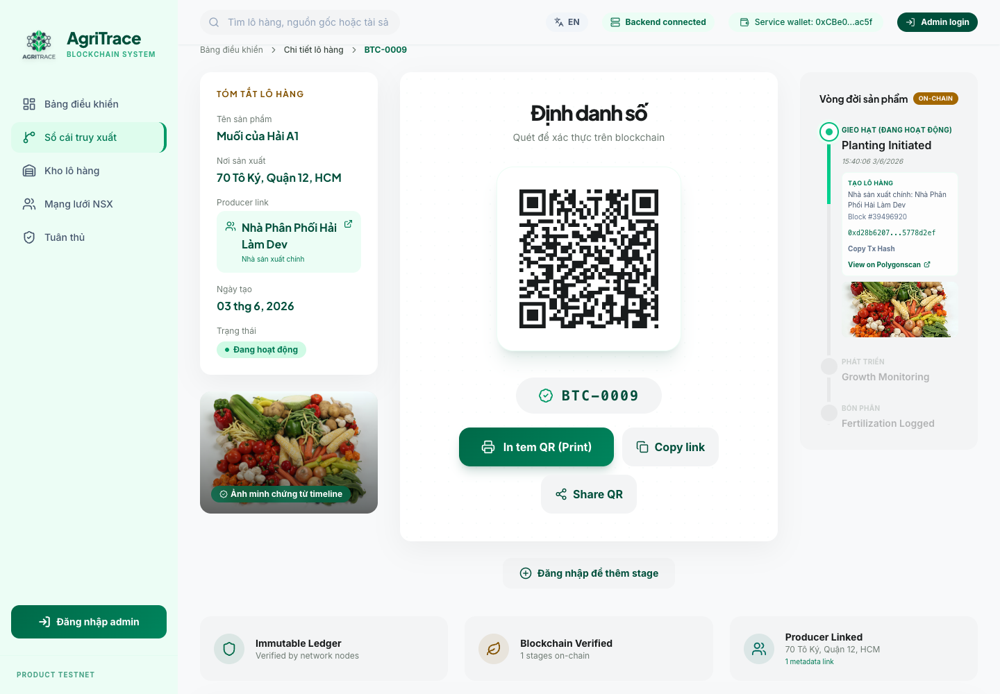
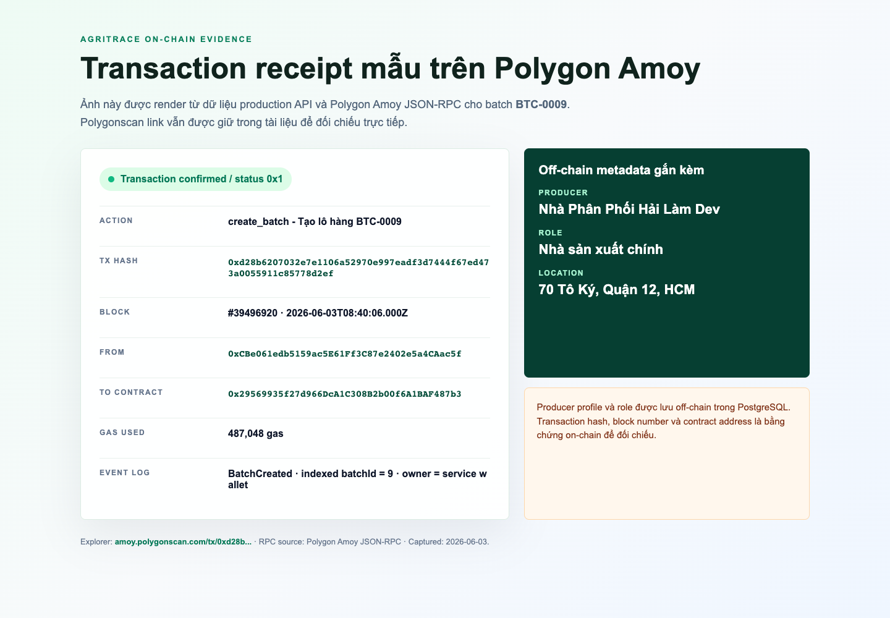

# On-chain vs Off-chain Data Model

Tài liệu này giải thích ranh giới dữ liệu của AgriTrace: dữ liệu nào được ghi lên smart contract, dữ liệu nào được lưu trong PostgreSQL/Cloudinary, và vì sao hệ thống chọn mô hình hybrid thay vì đưa toàn bộ dữ liệu lên blockchain.

## 1. Định hướng thiết kế

AgriTrace là một hệ thống truy xuất nguồn gốc nông sản có lớp bằng chứng blockchain. Hệ thống không cố lưu toàn bộ hồ sơ lên blockchain vì điều đó tốn gas, khó cập nhật, khó mở rộng và không phù hợp với dữ liệu hồ sơ như số điện thoại, email, mô tả nhà sản xuất, ảnh dung lượng lớn hoặc thông tin kiểm định nội bộ.

Mô hình hiện tại:

- Blockchain là nguồn bằng chứng bất biến cho sự tồn tại của lô hàng và lịch sử giai đoạn.
- PostgreSQL là lớp metadata vận hành cho hồ sơ nhà sản xuất, liên kết producer-batch, trạng thái kiểm định và dữ liệu phục vụ UI.
- Cloudinary/Unsplash là lớp lưu ảnh; smart contract chỉ lưu URL ảnh nếu URL đó được gửi trong transaction.
- Backend là relayer: ký giao dịch bằng service wallet để người dùng không cần cài ví, giữ private key hay trả gas trực tiếp.

Vì vậy, khi trình bày đề tài, nên gọi đây là mô hình **hybrid on-chain/off-chain traceability**: blockchain đảm bảo tính bất biến cho vòng đời lô hàng, database đảm bảo khả năng quản trị và trải nghiệm sản phẩm.

## 2. Dữ liệu lưu on-chain

Smart contract chính: `Traceability.sol`.

| Nhóm dữ liệu | Trường / sự kiện | Vai trò |
| --- | --- | --- |
| Batch core | `id`, `name`, `origin`, `owner`, `currentStage`, `createdAt`, `isActive` | Ghi nhận lô hàng tồn tại trên sổ cái và trạng thái hiện tại của lô. |
| Stage history | `stage`, `description`, `imageUrl`, `timestamp`, `updatedBy` | Ghi nhận từng mốc trong vòng đời lô hàng. Mỗi lần thêm stage tạo một bản ghi mới, không sửa stage cũ. |
| Access control | `systemAdmin`, `isWhitelistedProducer` | Kiểm soát ví nào được phép ghi dữ liệu vào contract. |
| Events | `BatchCreated`, `StageAdded`, `BatchCompleted`, `ProducerAdded`, `ProducerRemoved` | Tạo bằng chứng giao dịch có thể kiểm tra bằng block explorer. |
| Transaction proof | `tx hash`, `block number`, `block timestamp` | Không phải field do contract tự lưu, nhưng là bằng chứng cấp blockchain cho mỗi lần ghi dữ liệu. |

Lưu ý quan trọng:

- `imageUrl` là chuỗi URL, không phải byte ảnh. Ảnh thật nằm ngoài blockchain.
- Vì production dùng backend relayer, `owner` và `updatedBy` thường là service wallet đang ký transaction.
- Producer cụ thể như "Highland Coffee Co-op" hoặc "Bảo Lộc Tea Estate" không nằm trực tiếp trong struct `Batch`; quan hệ đó được lưu ở database metadata và được gắn lại theo `batchId`.

## 3. Dữ liệu lưu off-chain

### PostgreSQL

PostgreSQL lưu dữ liệu phục vụ quản trị, tìm kiếm và hiển thị chi tiết. Đây là phần cần có để sản phẩm hoạt động như một hệ thống quản lý thật, nhưng không thay thế bằng chứng on-chain.

| Bảng | Dữ liệu chính | Vai trò |
| --- | --- | --- |
| `producers` | `name`, `website`, `phone`, `email`, `location`, `status`, `description`, `image_url`, `coordinates`, `certifications`, `audits`, `farming_methods`, `social_impact` | Hồ sơ nhà sản xuất/đối tác. Cho phép admin cập nhật trạng thái kiểm định và thông tin liên hệ. |
| `batch_producer_links` | `batch_id`, `producer_id`, `producer_role`, `notes` | Liên kết lô hàng on-chain với producer trong database. Dùng để hiển thị "lô này thuộc nhà sản xuất nào". |
| `batch_transaction_records` | `batch_id`, `action`, `stage_index`, `tx_hash`, `block_number`, `actor_address`, `actor_producer_id`, `actor_role` | Lưu metadata giao dịch để UI mở Polygonscan nhanh, hiển thị actor/role và bằng chứng transaction. |

Các dữ liệu này có thể thay đổi theo nghiệp vụ, ví dụ admin cập nhật số điện thoại producer, đổi trạng thái từ "chờ kiểm định" sang "đã xác thực", hoặc bổ sung lịch sử kiểm định testnet. Những thay đổi như vậy không nên ghi thẳng lên blockchain vì không phải dữ liệu bất biến cốt lõi của vòng đời lô hàng.

### Image storage

Ảnh minh chứng được upload lên Cloudinary hoặc chọn từ thư viện ảnh. Blockchain chỉ nhận URL ảnh trong `imageUrl`. Cách này giúp:

- Tránh lưu file ảnh lớn trực tiếp trên chain.
- Giảm gas.
- Vẫn có thể chứng minh rằng tại thời điểm ghi stage, hệ thống đã gắn stage với một URL ảnh cụ thể.

Giới hạn hiện tại: URL không phải content hash. Nếu cần tăng mức kiểm chứng, phiên bản sau có thể lưu thêm SHA-256 hash hoặc IPFS CID của ảnh trong `StageRecord`.

### Frontend/session/cache

Frontend lưu session admin bằng token ngắn hạn trong browser storage. Backend có cache đọc blockchain để Dashboard, Ledger, Compliance tải nhanh hơn. Cache chỉ tối ưu tốc độ, không phải nguồn dữ liệu gốc.

## 4. Luồng ghi dữ liệu

### Tạo lô hàng

1. Admin đăng nhập vào web app.
2. Admin chọn producer đã xác thực trong database.
3. Frontend gửi `name`, `origin`, `imageUrl`, `producerId`, `producerRole` tới backend.
4. Backend kiểm tra producer tồn tại và đã `verified`.
5. Backend gọi smart contract `createBatch(name, origin, imageUrl)`.
6. Contract tạo `Batch` và stage đầu tiên `Seeding` trên-chain.
7. Backend nhận transaction receipt, lấy `batchId`, `txHash`, `blockNumber`.
8. Backend lưu `batch_producer_links` và `batch_transaction_records` trong PostgreSQL.
9. UI hiển thị Batch Detail, QR verification link và Polygonscan link.

### Thêm stage

1. Admin mở Batch Detail.
2. Admin chọn stage mới, actor/role và ảnh minh chứng.
3. Backend gọi smart contract `addStage(batchId, stage, description, imageUrl)`.
4. Contract thêm `StageRecord` mới vào lịch sử của lô.
5. Backend lưu transaction metadata để UI hiển thị actor, role, tx hash và block number.

## 5. Luồng đọc và xác minh

Khi người dùng mở QR hoặc trang Batch Detail:

1. Backend đọc `getBatch(batchId)` và `getStageHistory(batchId)` từ smart contract.
2. Backend đọc producer link và transaction metadata từ PostgreSQL.
3. Frontend gộp hai phần:
   - On-chain: tên lô, nguồn gốc, trạng thái, lịch sử stage, timestamp, ví ghi transaction.
   - Off-chain: producer profile, vai trò producer, thông tin liên hệ, tx link đã index.
4. Người dùng có thể mở Polygonscan để kiểm tra transaction thật trên Polygon Amoy.

Nếu database tạm lỗi, hệ thống vẫn có thể đọc dữ liệu lô hàng/stage từ blockchain, nhưng thông tin producer, số lô liên kết và hồ sơ liên hệ có thể thiếu. Nếu blockchain/RPC lỗi, hệ thống vẫn có thể xem hồ sơ producer, nhưng không thể xác minh vòng đời lô hàng.

## 6. Bằng chứng transaction mẫu

Ví dụ dưới đây dùng batch `BTC-0009` trên production demo. Đây là lô hàng được tạo qua backend relayer và có transaction thật trên Polygon Amoy testnet.

| Trường | Giá trị |
| --- | --- |
| Batch detail | [https://agri.hailamdev.space/batches/9](https://agri.hailamdev.space/batches/9) |
| Transaction | [0xd28b6207032e7e1106a52970e997eadf3d7444f67ed473a0055911c85778d2ef](https://amoy.polygonscan.com/tx/0xd28b6207032e7e1106a52970e997eadf3d7444f67ed473a0055911c85778d2ef) |
| Block | `39496920` |
| Timestamp | `2026-06-03T08:40:06.000Z` |
| Service wallet | `0xCBe061edb5159ac5E61Ff3C87e2402e5a4CAac5f` |
| Smart contract | `0x29569935f27d966DcA1C308B2b00f6A1BAF487b3` |
| Action | `create_batch` / tạo lô hàng `BTC-0009` |
| Producer metadata | `Nhà Phân Phối Hải Làm Dev`, vai trò `Nhà sản xuất chính`, lưu off-chain trong PostgreSQL |

Ảnh Batch Detail trên product cho thấy QR verification, producer link, timeline on-chain, block number và link mở Polygonscan:

Ảnh receipt dưới đây được render từ dữ liệu thật lấy qua production API và Polygon Amoy JSON-RPC. Đây không phải transaction giả; phần "mô phỏng" chỉ là giao diện trình bày để dễ đưa vào tài liệu/báo cáo.

Khi trình bày phản biện, có thể nói ngắn gọn:

> Batch Detail hiển thị dữ liệu gộp: lifecycle đọc từ smart contract, producer metadata đọc từ PostgreSQL. Transaction hash và block number có thể mở trên Polygonscan hoặc đối chiếu bằng JSON-RPC để chứng minh giao dịch đã được xác nhận trên Polygon Amoy.

## 7. Vì sao không đưa toàn bộ dữ liệu lên blockchain?

| Loại dữ liệu | Có nên on-chain? | Lý do |
| --- | --- | --- |
| ID lô hàng, tên, nguồn gốc, stage, timestamp | Có | Đây là dữ liệu lõi cần bất biến để truy xuất nguồn gốc. |
| URL ảnh minh chứng | Có thể | Contract hiện lưu URL để gắn stage với bằng chứng ảnh tại thời điểm ghi. |
| Ảnh gốc, video, file chứng nhận | Không | Dung lượng lớn, tốn gas, khó quản lý. |
| Số điện thoại, email, website producer | Không | Dữ liệu hồ sơ có thể thay đổi và có yếu tố riêng tư. |
| Trạng thái kiểm định nội bộ | Off-chain hiện tại | Cần admin cập nhật linh hoạt; phiên bản sau có thể anchor hash nếu cần kiểm toán mạnh hơn. |
| Search, dashboard, linked batch count | Không | Đây là dữ liệu tổng hợp phục vụ UX, có thể tính lại từ on-chain + database. |

## 8. Điểm trung thực cần nêu trong phản biện

Nên trình bày rõ các điểm sau:

- Blockchain trong AgriTrace không thay thế toàn bộ database.
- Blockchain là lớp bằng chứng bất biến cho lifecycle của lô hàng.
- Database là lớp quản trị hồ sơ, indexing và UX.
- Producer-batch link hiện là metadata off-chain, được gắn với `batchId` và transaction records.
- Nếu muốn tăng độ chặt, phiên bản sau có thể đưa `producerIdHash`, `producerProfileHash` hoặc `evidenceHash` vào contract.

Cách trả lời ngắn khi bị hỏi "dùng DB như vậy có sai đề tài blockchain không?":

> Không sai, vì mục tiêu của đề tài là dùng blockchain để đảm bảo tính bất biến và kiểm chứng được cho vòng đời truy xuất nông sản. Database chỉ lưu metadata vận hành như hồ sơ producer, contact, linked count và search. Nếu bỏ database, sản phẩm khó dùng và khó quản trị; nếu bỏ blockchain, hệ thống mất bằng chứng giao dịch độc lập và khả năng kiểm chứng bằng Polygonscan.

## 9. Hướng phát triển tiếp theo

- Lưu thêm `producerIdHash` hoặc `producerProfileHash` trong transaction để neo quan hệ producer vào blockchain.
- Lưu hash nội dung ảnh hoặc IPFS CID thay vì chỉ lưu URL.
- Cho phép nhiều actor ký transaction riêng bằng ví của producer/distributor/inspector hoặc account abstraction.
- Tách cache đọc blockchain sang Redis nếu cần chạy nhiều backend instance.
- Bổ sung audit trail cho thay đổi producer profile ở database.
